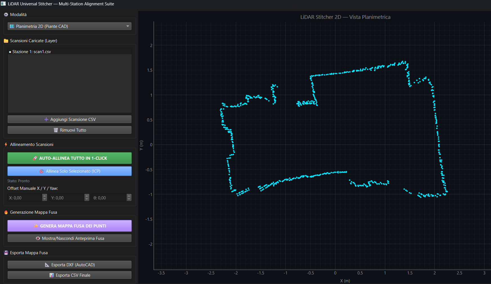
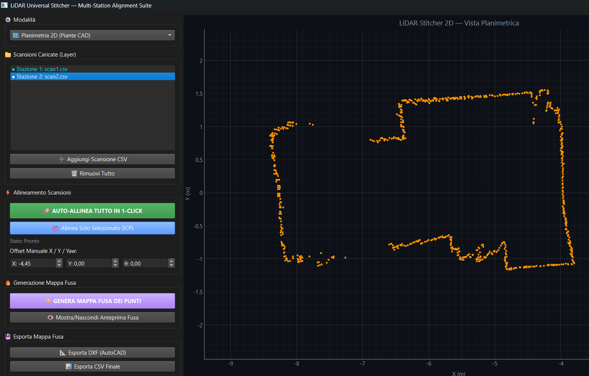
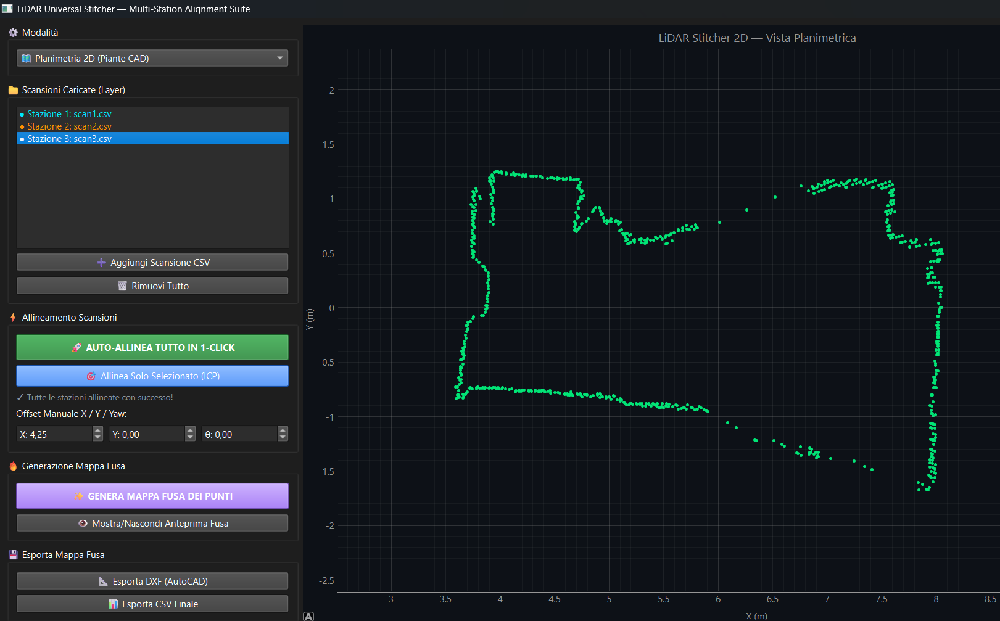
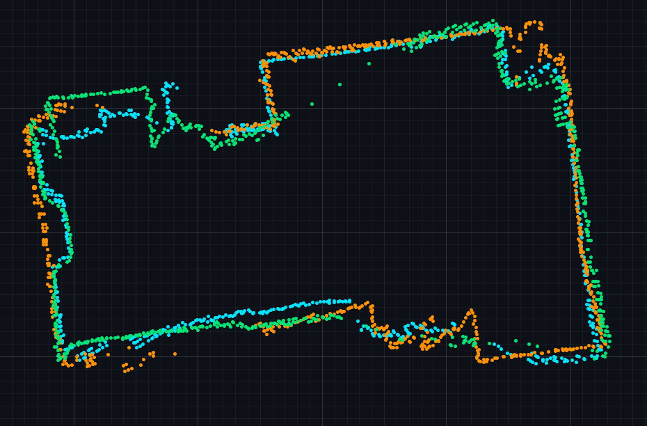
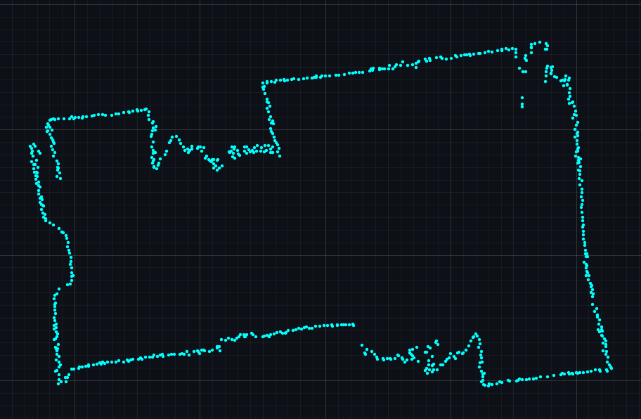

# 🗺️ LiDAR Universal Stitcher (`lidar-multi-station-fusion`)

A high-performance desktop application built with Python, PyQt6, and PyQtGraph for multi-station LiDAR scan registration, automatic 2D/3D alignment, and high-fidelity geometric fusion (indoor 2D architectural perimeter extraction & 3D volumetric cloud reconstruction).

Designed to produce clean, single-layer floorplans and watertight 3D models by eliminating double-wall tracks, phantom reflections, and overlapping artifacts between adjacent scanning stations.

---

## 📸 Interface & Multi-Station Workflow

### 1. Multi-Station Scan Loading (2D Planar Mode)
Inspect individual station point clouds with dedicated layer controls and real-time 3-DoF manipulation.

| Station 1 (Base Layer) | Station 2 (Offset Alignment) | Station 3 (Full Span) |
| :---: | :---: | :---: |
|  |  |  |

---

### 2. Multi-Station Fusion Pipeline (2D Before vs After)

Comparison showing the removal of parallel ghost walls through Hard Bounding-Box Spatial Slicing and Micro-Snap Boundary Welding:

| ❌ Raw Overlap (Pre-Fusion) | ✅ Clean Perimeter (Post-Fusion) |
| :---: | :---: |
|  |  |
| *Multi-station overlap with double-wall artifacts and angular drift* | *Unified single-layer perimeter with seamless boundary welding* |

---

### 3. 3D Volumetric Multi-Station Alignment & Fusion

Full 3D volumetric workflow with 6-DoF cascade registration, horizon-aware 3-band vertical authority partitioning, and OpenGL interactive rendering.

https://github.com/user-attachments/assets/a9956a8a-90a6-4aec-bc18-8eb90867c8ef

---

## 🌟 Key Features

### 🗺️ 2D Planimetric Suite
- **Coarse-to-Fine Point-to-Line ICP Alignment:**
  - Robust iterative alignment leveraging local normal estimation.
  - Mitigates wall-sliding drift and handles large initial misalignments down to millimeter precision.
- **Hard Bounding-Box Spatial Slicing:**
  - Dynamically partitions the global room footprint into exclusive sectors based on real sensor coordinates.
  - Grants absolute authority to the closest station for each sector, removing ghost lines and parallel wall artifacts.
- **Micro-Snap Seam Smoothing & Welding:**
  - Eliminates alignment height steps and bridges micro-gaps at partition cutlines.
  - Preserves structural corners while ensuring seamless perimeter continuity.

### 🧊 3D Volumetric Suite
- **Full 6-DoF SVD Point-to-Point ICP:**
  - Matrix rototranslation solver across all degrees of freedom ($\text{Yaw } \theta_z, \text{Pitch } \theta_y, \text{Roll } \theta_x + T_x, T_y, T_z$).
  - **1-Click Global Auto-Align:** Cascaded alignment of all imported 3D station scans against the accumulated spatial model.
- **Dual-Ratio 3-Band Vertical Authority Partitioning:**
  - **Central Band (2/3 of Total Height — Eye-Level/Horizon Walls):** *Strict exclusivity* for the reference station. Eliminates double-wall ghosts and thickness artifacts.
  - **Upper & Lower Bands (1/6 each — Ceiling & Floor):** *Cooperative blending* across neighboring stations to close zenith blind cones and preserve full room enclosures without clipping the roof.
- **k-d Tree Boundary Welding & 3D Voxel Grid Filter:**
  - Sub-pixel centroid averaging in 3D cubic cells ($3\text{ cm}$) to suppress instrument noise and enforce uniform density.

### 🖥️ Universal Core & GUI
- **Universal Smart Parser:**
  - Automatically handles arbitrary delimiters (spaces, commas, tabs, semicolons) and headers (`X_m`, `Angle_deg`, `Distance_cm`, raw `X Y Z`).
  - Real-time unit detection and automatic normalization (centimeters to meters).
- **Interactive Dual Viewport (PyQt6 + PyQtGraph + OpenGL):**
  - Seamless switching between 2D Planar and 3D Volumetric canvases.
  - Dynamic Point Size control slider (`1` to `10 px`) for high-DPI inspection.
- **Multi-Format Export:**
  - **2D:** AutoCAD-compliant DXF vector drawings & clean CSV tables.
  - **3D:** Standard ASCII PLY point clouds (compatible with CloudCompare, MeshLab, Blender, Revit) & $(X, Y, Z)$ CSV tables.

---
## 🚀 Usage Workflow

1. **Launch the Application:**

   python main.py

2. **Import Scans:**

   Click "Load CSV Scans" to import 2 or more station files from different scanning positions.

3. **Align Point Clouds:**

   Click "1-CLICK AUTO-ALIGN" to run the multi-station cascade ICP solver, or adjust station positions manually using the X, Y, and Yaw controls.

4. **Fuse & Extract Perimeter:**

   Click "GENERATE FUSED MAP" to apply spatial slicing, seam welding, and voxel downsampling.

5. **Export CAD Plan:**

   Click "Export DXF" to save the vector drawing for AutoCAD, Revit, or Rhino.

---
